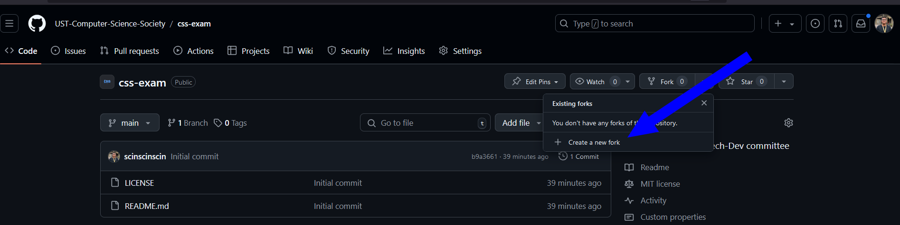
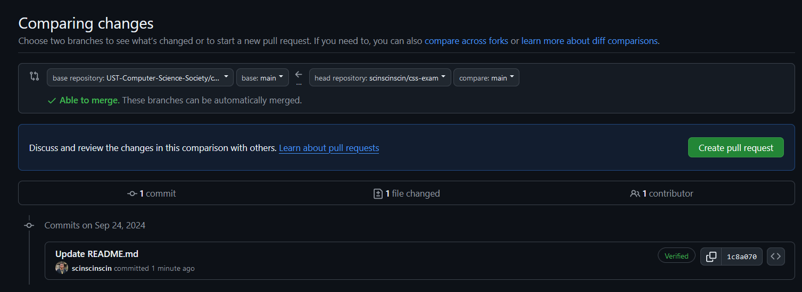

## CSS Tech Dev Committee

Congratulations for making it this far, ka-CS. 

Your next task is a practical exam showing your front-end web development skills. Your goal is to bring [this Figma file](https://www.figma.com/file/GSch1TKOEc3bkVUtrfxtAr/Exam?node-id=0%3Al&t=tHtmvzPZNroTPA4f-0) to life using HTML, CSS, and other related web technologies.

### Take the Challenge!
1. Fork this repository into your personal account. This is where you will be working on the exam.

2. Develop a website using [this Figma file](https://www.figma.com/file/GSch1TKOEc3bkVUtrfxtAr/Exam?node-id=0%3Al&t=tHtmvzPZNroTPA4f-0) as a reference.
   1. Use the included design system and components as reference.
   2. If you need additional assets, you may take them from [Unsplash](https://unsplash.com/)
   3. Your website must be responsive. It is up to you to decide how the website should look in tablet and mobile form factors.
3. You are given **7 days** to complete your exam. Once finished, submit a pull request into this repo from your repository.
   1. Go to the ["Pull requests"](https://github.com/UST-Computer-Science-Society/css-exam/pulls) tab in this repository
   2. Click "New Pull Request"
   3. Click "compare across forks"
   4. Select your fork
     
   5. Click "Create pull request"

---

### Evaluation

**Your exam submission will be evaluated based on the following criteria:**
 - Theme and Consistency
   - The website adheres the given Figma design, and is consistent in its use of fonts, colors, spacing, and other design elements
 - Code Structure
   - The code is easy to read and understand. It is maintainable and follows clean code principles of DRY (with the use of components).
 - Functionality
   - The navigation and subject section buttons are wired and perform their associated actions properly when clicked. The latest post carousel functions correctly and changes the data presented in the correct interval or when interacted with.
 - Animation
   - The website uses animations appropriately, providing interactive feedback to the user whenever actions are performed such as hovering over elements, clicking buttons, or navigating.
 - Layout
   - The website is responsive. Elements collapse into smaller variants at proper intervals and the website has no overflow under constrained screen sizes.